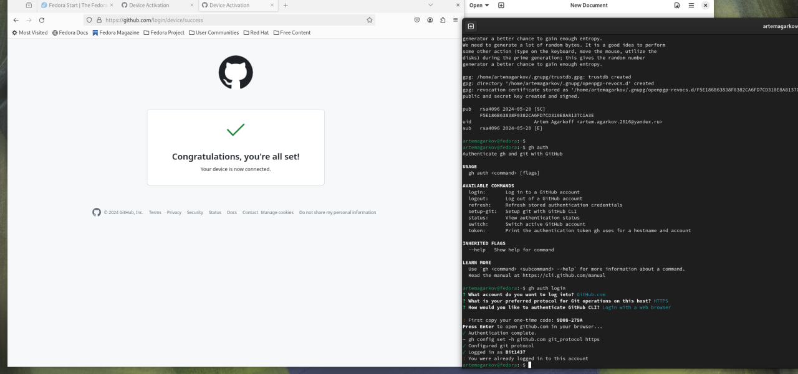

**Лабораторная работа №2 Первоначальна настройка git**

**Дисциплина Операционные системы**

Агарков Артём Сергеевич НПМбв-02-20" 
# Содержание" 
[Цель работы	1](#_toc162206555)

[Выполнение лабораторной работы	1](#_toc162206556)

[Настройка GIT	1](#_toc162206557)

[Создание рабочего пространства	5](#_toc162206558)

[Ответы на контрольные вопросы	6](#_toc162206559)

[Выводы	7](#_toc162206560)

# **Цель работы**
- Изучить применение средств контроля версий
- Освоить умения по работе с git'ом
# **Выполнение лабораторной работы**
## **Настройка GIT**
` `Сконфигурируем git и создадим SSH ключ

` `Создадим PGP ключ

С помощью команды gpg --armor --export <PGP Fingerprint> | xclip -sel clip скопируем PGP ключ.
И вставим в наш Github.

Авторизируемся в Github с помощью комманды gh

## 
## **Создание рабочего пространства**

Склонируем репозиторий на локальную машину

# **Ответы на контрольные вопросы**
#### *Что такое системы контроля версий (VCS) и для решения каких задач они предназначаются?*
Системы контроля версий (VCS) предназначены для отслеживания изменений в программном коде и обеспечения коллективной разработки.
#### *Объясните следующие понятия VCS и их отношения: хранилище, commit, история, рабочая копия.*
Хранилище: Место, где хранятся все изменения и версии программного кода. 
Commit: Отдельное изменение или набор изменений в коде, зафиксированное в системе контроля версий. 
История: Последовательность коммитов, отображающая эволюцию кода. 
Рабочая копия: Локальная копия проекта, с которой работает разработчик.
#### *Что представляют собой и чем отличаются централизованные и децентрализованные VCS? Приведите примеры VCS каждого вида.*
Децентрализованные VCS копируют всю историю изменений на каждый клиентский компьютер, в то время как централизованные VCS хранят все изменения на центральном сервере и клиенты получают только последние версии файлов. Примеры децентрализованных VCS: Git, Mercurial. Примеры централизованных VCS: Subversion, CVS.
#### *Опишите действия с VCS при единоличной работе с хранилищем.*
При индивидуальной разработке пользователь клонирует проект на свой компьютер, вносит изменения и создает новые версии, коммитя их в системе контроля версий.
#### *Опишите порядок работы с общим хранилищем VCS.*
Пользователь получает версию проекта из центрального хранилища, вносит изменения, коммитит их и отправляет обратно в хранилище.
#### *Каковы основные задачи, решаемые инструментальным средством git?*
Git используется для разработки проектов в команде, контроля изменений в файлах и возможности сохранения нескольких состояний проекта.
#### *Назовите и дайте краткую характеристику командам git.*
git add - добавляет изменения для коммита.

git commit - сохраняет изменения в репозитории с названием.

git push - отправляет изменения на удаленный репозиторий.

git config - позволяет изменить настройки Git.
#### *Приведите примеры использования при работе с локальным и удалённым репозиториями.*
В локальном репозитории разработчик может вносить изменения в код и коммитить их без доступа к сети. В удаленном репозитории команда разработчиков может совместно работать над проектом, обмениваясь изменениями через централизованный сервер.
#### *Что такое и зачем могут быть нужны ветви (branches)?*
Ветви используются для параллельной разработки функций или исправлений, чтобы избежать конфликтов между изменениями и обеспечить безопасное тестирование нового кода.
#### *Как и зачем можно игнорировать некоторые файлы при commit?*
Файлы могут быть проигнорированы с помощью файла .gitignore, чтобы избежать загрязнения репозитория лишними или конфиденциальными файлами.
# **Выводы**
Мы изучили идеологию применения средств контроля версий и освоили базовые комманды git'а. 

