---
## Front matter
title: "
Лабораторная работа № 5

Анализ файловой структуры UNIX. Команды для работы с файлами и каталогами"
subtitle: "Простейший вариант"
author: "Агарков Артём"

## Generic otions
lang: ru-RU
toc-title: "Содержание"

## Bibliography
bibliography: bib/cite.bib
csl: pandoc/csl/gost-r-7-0-5-2008-numeric.csl

## Pdf output format
toc: true # Table of contents
toc-depth: 2
lof: true # List of figures
lot: true # List of tables
fontsize: 12pt
linestretch: 1.5
papersize: a4
documentclass: scrreprt
## I18n polyglossia
polyglossia-lang:
  name: russian
  options:
	- spelling=modern
	- babelshorthands=true
polyglossia-otherlangs:
  name: english
## I18n babel
babel-lang: russian
babel-otherlangs: english
## Fonts
mainfont: PT Serif
romanfont: PT Serif
sansfont: PT Sans
monofont: PT Mono
mainfontoptions: Ligatures=TeX
romanfontoptions: Ligatures=TeX
sansfontoptions: Ligatures=TeX,Scale=MatchLowercase
monofontoptions: Scale=MatchLowercase,Scale=0.9
## Biblatex
biblatex: true
biblio-style: "gost-numeric"
biblatexoptions:
  - parentracker=true
  - backend=biber
  - hyperref=auto
  - language=auto
  - autolang=other*
  - citestyle=gost-numeric
## Pandoc-crossref LaTeX customization
figureTitle: "Рис."
tableTitle: "Таблица"
listingTitle: "Листинг"
lofTitle: "Список иллюстраций"
lotTitle: "Список таблиц"
lolTitle: "Листинги"
## Misc options
indent: true
header-includes:
  - \usepackage{indentfirst}
  - \usepackage{float} # keep figures where there are in the text
  - \floatplacement{figure}{H} # keep figures where there are in the text
---

# Цель работы

Ознакомление с файловой системой Linux, её структурой, именами и содержанием
каталогов. Приобретение практических навыков по применению команд для работы
с файлами и каталогами, по управлению процессами (и работами), по проверке использования диска и обслуживанию файловой системы.

# Выполнение лабораторной работы:

# Команды для работы с файлами и каталогами
Для создания текстового файла можно использовать команду touch.\
Формат команды:\
1 touch имя-файла\
Для просмотра файлов небольшого размера можно использовать команду cat.\
Формат команды:\
1 cat имя-файла\
Для просмотра файлов постранично удобнее использовать команду less.\
Формат команды:\
1 less имя-файла\
Следующие клавиши используются для управления процессом просмотра:\
– Space — переход к следующей странице,\
– ENTER — сдвиг вперёд на одну строку,\
– b — возврат на предыдущую страницу,\
– h — обращение за подсказкой,\
– q — выход из режима просмотра файла.\
Команда head выводит по умолчанию первые 10 строк файла.\
Формат команды:\
1 head [-n] имя-файла,\
где n — количество выводимых строк.\
Команда tail выводит умолчанию 10 последних строк файла.\
Формат команды:\
1 tail [-n] имя-файла,\
где n — количество выводимых строк.\

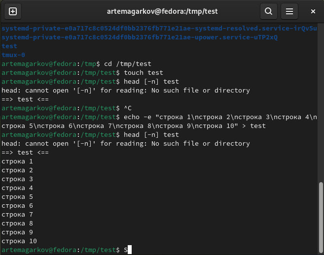

# Копирование файлов и каталогов
Команда cp используется для копирования файлов и каталогов.\
Формат команды:\
1 cp [-опции] исходный_файл целевой_файл\
Примеры:\
1. Копирование файла в текущем каталоге. Скопировать файл ~/abc1 в файл april\
и в файл may:\
1 cd\
2 touch abc1\
3 cp abc1 april\
4 cp abc1 may\
2. Копирование нескольких файлов в каталог. Скопировать файлы april и may в каталог\
monthly:\
1 mkdir monthly\
2 cp april may monthly\
3. Копирование файлов в произвольном каталоге.Скопировать файл monthly/may в файл\
с именем june:\
1 cp monthly/may monthly/june\
2 ls monthly\
Опция i в команде cp выведет на экран запрос подтверждения о перезаписи файла.\
Для рекурсивного копирования каталогов, содержащих файлы, используется команда\
cp с опцией r.\
Примеры:\
1. Копирование каталогов в текущем каталоге. Скопировать каталог monthly в каталог\
monthly.00:\
1 mkdir monthly.00\
2 cp -r monthly monthly.00\
2. Копирование каталогов в произвольном каталоге. Скопировать каталог monthly.00\
в каталог /tmp\
1 cp -r monthly.00 /tmp\

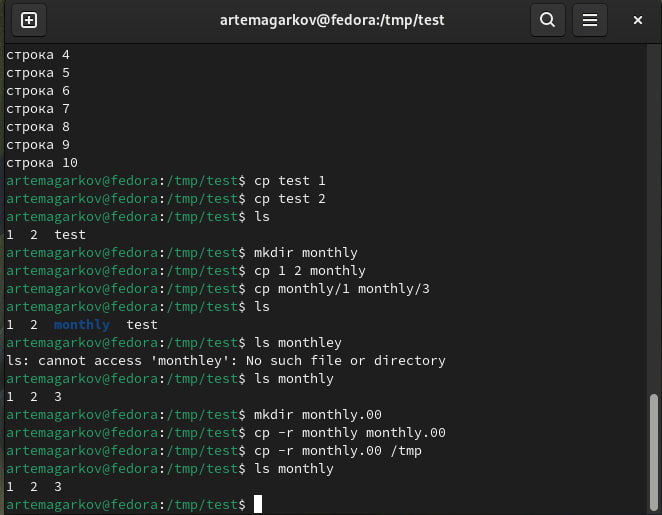
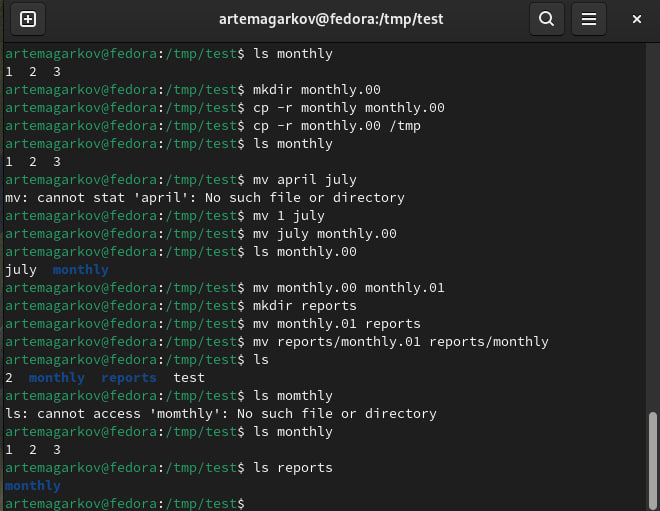
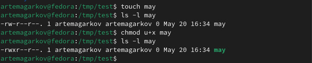

# Изменение прав доступа
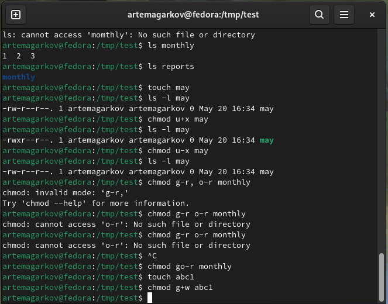

# Анализ файловой системы
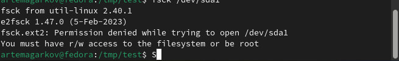
# Последовательное выполнение работы:
2.1Скопируйте файл /usr/include/sys/io.h в домашний каталог и назовите его
equipment. Если файла io.h нет, то используйте любой другой файл в каталоге
/usr/include/sys/ вместо него\
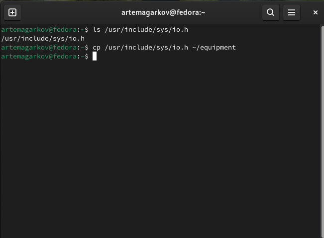
2.2. В домашнем каталоге создайте директорию ~/ski.plases.\
2.3. Переместите файл equipment в каталог ~/ski.plases.\
2.4. Переименуйте файл ~/ski.plases/equipment в ~/ski.plases/equiplist.\
2.5. Создайте в домашнем каталоге файл abc1 и скопируйте его в каталог\
~/ski.plases, назовите его equiplist2.\
2.6. Создайте каталог с именем equipment в каталоге ~/ski.plases.\
2.7. Переместите файлы ~/ski.plases/equiplist и equiplist2 в каталог\
~/ski.plases/equipment.\
2.8. Создайте и переместите каталог ~/newdir в каталог ~/ski.plases и назовите\
его plans.\
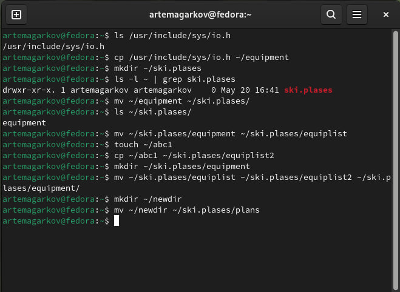\
3. Определите опции команды chmod, необходимые для того, чтобы присвоить перечисленным ниже файлам выделенные права доступа, считая, что в начале таких прав
нет:\
3.1. drwxr--r-- ... australia\
3.2. drwx--x--x ... play\
3.3. -r-xr--r-- ... my_os\
3.4. -rw-rw-r-- ... feathers\
При необходимости создайте нужные файлы\
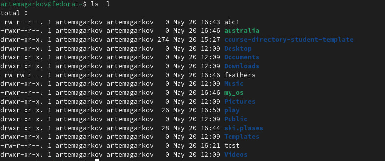\
4.1 Просмотрите содержимое файла /etc/password.\
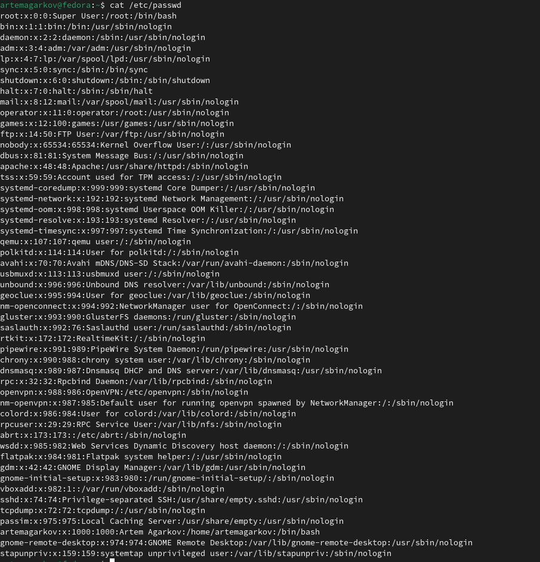\
4.2. Скопируйте файл ~/feathers в файл ~/file.old.\
4.3. Переместите файл ~/file.old в каталог ~/play.\
4.4. Скопируйте каталог ~/play в каталог ~/fun.\
4.5. Переместите каталог ~/fun в каталог ~/play и назовите его games.\
4.6. Лишите владельца файла ~/feathers права на чтение.\
4.7. Что произойдёт, если вы попытаетесь просмотреть файл ~/feathers командой
cat?\
4.8. Что произойдёт, если вы попытаетесь скопировать файл ~/feathers?\
4.9. Дайте владельцу файла ~/feathers право на чтение.\
4.10. Лишите владельца каталога ~/play права на выполнение.\
4.11. Перейдите в каталог ~/play. Что произошло?\
4.12. Дайте владельцу каталога ~/play право на выполнение.\
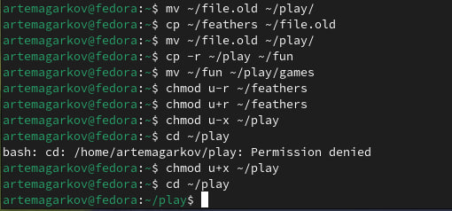\
5. Прочитайте man по командам mount, fsck, mkfs, kill и кратко их охарактеризуйте,
приведя примеры. \
mount:\

Описание: Команда mount используется для подключения файловых систем к директориям в файловой системе.\
Примеры:\
mount /dev/sdb1 /mnt - подключает файловую систему, расположенную на устройстве /dev/sdb1, к точке монтирования /mnt.\
mount -t ntfs /dev/sda1 /media/windows - подключает NTFS файловую систему, расположенную на устройстве /dev/sda1, к точке монтирования /media/windows.\
fsck:\
\
Описание: Команда fsck используется для проверки и восстановления целостности файловых систем.\
Примеры:\
fsck /dev/sda1 - проверяет и исправляет ошибки в файловой системе, расположенной на устройстве /dev/sda1.\
fsck.ext4 -f /dev/sdb1 - проводит принудительную проверку файловой системы типа ext4 на устройстве /dev/sdb1.\
mkfs:\
\
Описание: Команда mkfs используется для создания новой файловой системы на указанном устройстве.\
Примеры:\
mkfs.ext4 /dev/sdb1 - создаёт файловую систему типа ext4 на устройстве /dev/sdb1.\
mkfs -t ntfs /dev/sdc1 - создаёт файловую систему типа NTFS на устройстве /dev/sdc1.\
kill:\
\
Описание: Команда kill используется для отправки сигналов процессам или завершения процессов.\
Примеры:\
kill -9 1234 - отправляет сигнал SIGKILL процессу с идентификатором 1234, принудительно завершая его.\
killall firefox - завершает все процессы с именем "firefox".\

# Контрольные вопросы
1. Дайте характеристику каждой файловой системе, существующей на жёстком диске\
компьютера, на котором вы выполняли лабораторную работу.\
2. Приведите общую структуру файловой системы и дайте характеристику каждой директории первого уровня этой структуры.\
3. Какая операция должна быть выполнена, чтобы содержимое некоторой файловой\
системы было доступно операционной системе?\
4. Назовите основные причины нарушения целостности файловой системы. Как устранить повреждения файловой системы?\
5. Как создаётся файловая система?\
6. Дайте характеристику командам для просмотра текстовых файлов.\
7. Приведите основные возможности команды cp в Linux.\
54 Лабораторная работа № 5. Анализ файловой системы Linux. Команды для работы …\
8. Приведите основные возможности команды mv в Linux.\
9. Что такое права доступа? Как они могут быть изменены?9. \
\
1. Характеристика каждой файловой системы на жёстком диске:\
\
На компьютере используются различные файловые системы, такие как ext4, NTFS, FAT32 и другие, в зависимости от настроек и установок операционной системы.\
Файловая система ext4 является наиболее распространённой на системах Linux, предоставляя хорошую производительность и надёжность.\
NTFS часто используется в системах Windows, а FAT32 - более старая файловая система, поддерживаемая различными операционными системами.\
2. Общая структура файловой системы и характеристика директорий первого уровня:\
\
Обычно файловая система начинается с корневой директории /, содержащей другие директории и файлы.\
Примеры директорий первого уровня:\
/bin: содержит исполняемые файлы для запуска основных системных утилит.\
/etc: хранит системные конфигурационные файлы.\
/home: директории пользователей.\
/lib: библиотеки, используемые программами.\
/usr: вторичная иерархия для размещения несистемных данных.\
3. Для доступности содержимого файловой системы операционной системе нужно выполнить монтирование.\
\
Это операция, при которой файловая система прикрепляется к директории в другой файловой системе, делая её доступной для использования.\
4. Причины нарушения целостности файловой системы и способы устранения повреждений:\
\
Нарушения целостности могут произойти из-за сбоев в питании, отключения устройства без безопасного извлечения, программных ошибок и т.д.\
Для восстановления целостности файловой системы может потребоваться использование инструментов проверки и восстановления, таких как fsck в Linux.\
5. Создание файловой системы:\
\
Для создания файловой системы используется команда mkfs, которая принимает в качестве аргумента тип файловой системы и устройство, на котором будет создана \файловая система.\
6. Команды для просмотра текстовых файлов:\
\
Для просмотра текстовых файлов используются команды cat, less, more, head, tail.\
Например, cat filename выводит содержимое файла на экран.\
7. Основные возможности команды cp в Linux:\
\
Копирование файлов и директорий.\
Создание копий файлов с различными именами.\
Рекурсивное копирование содержимого директорий.\
Копирование файлов с различными правами доступа.\
8. Основные возможности команды mv в Linux:\
\
Перемещение файлов и директорий.\
Переименование файлов и директорий.\
Перемещение файлов с различными правами доступа.\
Объединение нескольких директорий.\
9. Права доступа:\
\
Права доступа определяют, кто может просматривать, изменять или выполнять файлы и директории.\
Изменять права доступа можно с помощью команды chmod. Например, chmod 755 filename устанавливает права на чтение, запись и выполнение для владельца, и на чтение и выполнение для группы и остальных пользователей.\

# Выводы

Изучение файловой системы Linux, её структуры и содержания каталогов, а также приобретение практических навыков работы с файлами, каталогами и управления процессами является важной частью освоения операционной системы. В ходе лабораторной работы были изучены основные команды для работы с файлами и каталогами, такие как ls, cp, mv, mkdir, rm, а также команды для управления процессами, такие как kill и ps. Также были рассмотрены команды для проверки использования диска и обслуживания файловой системы, такие как df, du, fsck.
