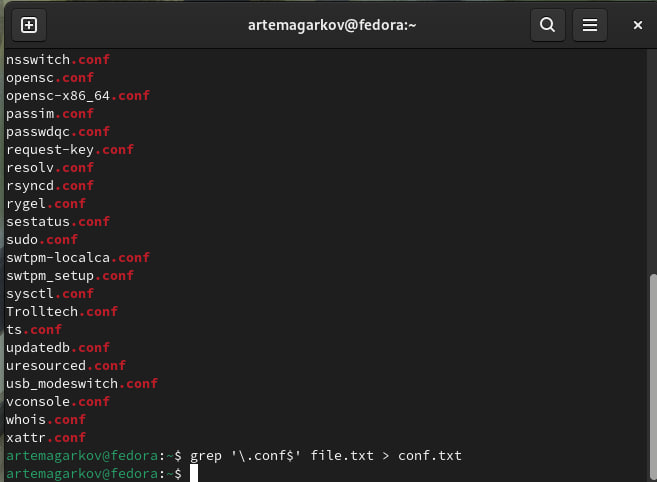

---
## Front matter
title: "Лабораторная работа № 6\
Поиск файлов. Перенаправление ввода-вывода. Просмотр запущенных процессов"
subtitle: "Простейший вариант"
author: "Агарков Артём"

## Generic otions
lang: ru-RU
toc-title: "Содержание"

## Bibliography
bibliography: bib/cite.bib
csl: pandoc/csl/gost-r-7-0-5-2008-numeric.csl

## Pdf output format
toc: true # Table of contents
toc-depth: 2
lof: true # List of figures
lot: true # List of tables
fontsize: 12pt
linestretch: 1.5
papersize: a4
documentclass: scrreprt
## I18n polyglossia
polyglossia-lang:
  name: russian
  options:
	- spelling=modern
	- babelshorthands=true
polyglossia-otherlangs:
  name: english
## I18n babel
babel-lang: russian
babel-otherlangs: english
## Fonts
mainfont: PT Serif
romanfont: PT Serif
sansfont: PT Sans
monofont: PT Mono
mainfontoptions: Ligatures=TeX
romanfontoptions: Ligatures=TeX
sansfontoptions: Ligatures=TeX,Scale=MatchLowercase
monofontoptions: Scale=MatchLowercase,Scale=0.9
## Biblatex
biblatex: true
biblio-style: "gost-numeric"
biblatexoptions:
  - parentracker=true
  - backend=biber
  - hyperref=auto
  - language=auto
  - autolang=other*
  - citestyle=gost-numeric
## Pandoc-crossref LaTeX customization
figureTitle: "Рис."
tableTitle: "Таблица"
listingTitle: "Листинг"
lofTitle: "Список иллюстраций"
lotTitle: "Список таблиц"
lolTitle: "Листинги"
## Misc options
indent: true
header-includes:
  - \usepackage{indentfirst}
  - \usepackage{float} # keep figures where there are in the text
  - \floatplacement{figure}{H} # keep figures where there are in the text
---

# Цель работы

Ознакомление с инструментами поиска файлов и фильтрации текстовых данных.
Приобретение практических навыков: по управлению процессами (и заданиями), по
проверке использования диска и обслуживанию файловых систем.

# Задание

1. Осуществите вход в систему, используя соответствующее имя пользователя.
2. Запишите в файл file.txt названия файлов, содержащихся в каталоге /etc. Допишите в этот же файл названия файлов, содержащихся в вашем домашнем каталоге.
3. Выведите имена всех файлов из file.txt, имеющих расширение .conf, после чего
запишите их в новый текстовой файл conf.txt.
4. Определите, какие файлы в вашем домашнем каталоге имеют имена, начинавшиеся
с символа c? Предложите несколько вариантов, как это сделать.
5. Выведите на экран (по странично) имена файлов из каталога /etc, начинающиеся
с символа h.
6. Запустите в фоновом режиме процесс, который будет записывать в файл ~/logfile
файлы, имена которых начинаются с log.
7. Удалите файл ~/logfile.
8. Запустите из консоли в фоновом режиме редактор gedit.
9. Определите идентификатор процесса gedit, используя команду ps, конвейер и фильтр
grep. Как ещё можно определить идентификатор процесса?
10. Прочтите справку (man) команды kill, после чего используйте её для завершения
процесса gedit.
11. Выполните команды df и du, предварительно получив более подробную информацию
об этих командах, с помощью команды man.
12. Воспользовавшись справкой команды find, выведите имена всех директорий, имеющихся в вашем домашнем каталоге.

# Выполнение лабораторной работы
2. Запишите в файл file.txt названия файлов, содержащихся в каталоге /etc. Допишите в этот же файл названия файлов, содержащихся в вашем домашнем каталоге.

3. Выведите имена всех файлов из file.txt, имеющих расширение .conf, после чего
запишите их в новый текстовой файл conf.txt.4\

4. Определите, какие файлы в вашем домашнем каталоге имеют имена, начинавшиеся
с символа c? Предложите несколько вариантов, как это сделать.

5. Выведите на экран (по странично) имена файлов из каталога /etc, начинающиеся
с символа h

6. Запустите в фоновом режиме процесс, который будет записывать в файл ~/logfile
файлы, имена которых начинаются с log.

7. Удалите файл ~/logfile.

8. Запустите из консоли в фоновом режиме редактор gedit.

9. Определите идентификатор процесса gedit, используя команду ps, конвейер и фильтр
grep. Как ещё можно определить идентификатор процесса?

10. Прочтите справку (man) команды kill, после чего используйте её для завершения
процесса gedit.

11. Выполните команды df и du, предварительно получив более подробную информацию
об этих командах, с помощью команды man

12. Воспользовавшись справкой команды find, выведите имена всех директорий, имеющихся в вашем домашнем каталоге.

# 6.5. Контрольные вопросы и ответы
1. Какие потоки ввода вывода вы знаете?
- Потоки ввода-вывода (stdin, stdout, stderr) представляют собой каналы для передачи данных между программой и внешним миром. stdin (стандартный ввод) принимает ввод от пользователя или другой программы, stdout (стандартный вывод) отправляет вывод программы пользователю или другим программам, а stderr (стандартная ошибка) используется для вывода сообщений об ошибках.
2. Объясните разницу между операцией > и >>.
- Операция > используется для перенаправления вывода в файл. Если файл уже существует, он будет перезаписан. Операция >> также перенаправляет вывод в файл, но добавляет его в конец файла, вместо перезаписи.
3. Что такое конвейер?
- Конвейер (pipeline) - это последовательность процессов, в которой вывод одного процесса используется в качестве ввода для следующего. Оператор | используется для создания конвейера в командной строке.
4. Что такое процесс? Чем это понятие отличается от программы?
- Процесс - это экземпляр программы, который выполняется на компьютере. Программа - это набор инструкций, которые выполняются процессором. Программа может иметь несколько экземпляров (процессов), работающих одновременно.
5. Что такое PID и GID?
- PID (идентификатор процесса) - это уникальный числовой идентификатор, присвоенный каждому процессу операционной системой. GID (идентификатор группы) - это уникальный числовой идентификатор группы пользователей.
6. Что такое задачи и какая команда позволяет ими управлять?
- Задачи (или процессы) - это работающие экземпляры программ. Команда ps (process status) позволяет просматривать информацию о процессах, а команда kill позволяет завершать или отправлять сигналы процессам.
7. Найдите информацию об утилитах top и htop. Каковы их функции?
- top - это интерактивная утилита мониторинга процессов в реальном времени. htop - это альтернатива top с более интерактивным интерфейсом и дополнительными функциями, такими как цветовая кодировка и удобный поиск.
8. Назовите и дайте характеристику команде поиска файлов. Приведите примеры использования этой команды.
- Команда поиска файлов find позволяет находить файлы и каталоги на основе различных критериев, таких как имя, тип, размер и т.д. Примеры использования: find /home/user -name "*.txt" - поиск всех файлов с расширением .txt в каталоге /home/user.
9. Можно ли по контексту (содержанию) найти файл? Если да, то как?
- Да, по контексту (содержанию) можно найти файлы, используя команду grep, которая позволяет искать текст внутри файлов.
10. Как определить объем свободной памяти на жёстком диске?
- Для определения объема свободной памяти на жёстком диске можно использовать команду df -h, которая покажет информацию о доступном месте на файловых системах.
11. Как определить объем вашего домашнего каталога?
- Чтобы определить объем вашего домашнего каталога, можно использовать команду du -sh ~/.
12. Как удалить зависший процесс?
- Чтобы удалить зависший процесс, можно воспользоваться командой kill -9 <PID>, где <PID> - это идентификатор зависшего процесса.

# Выводы

Учеба с инструментами поиска файлов и фильтрации текста помогла мне находить нужные файлы и извлекать информацию. Умение управлять процессами дало возможность контролировать работу программ и оптимизировать ресурсы. Изучение проверки использования диска помогло поддерживать стабильность работы компьютера и целостность данных.

