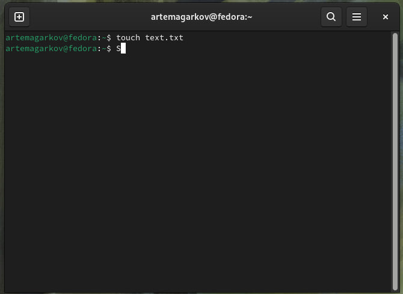
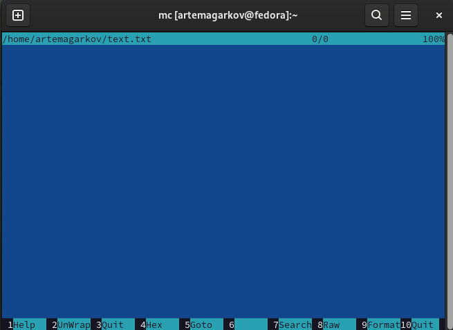
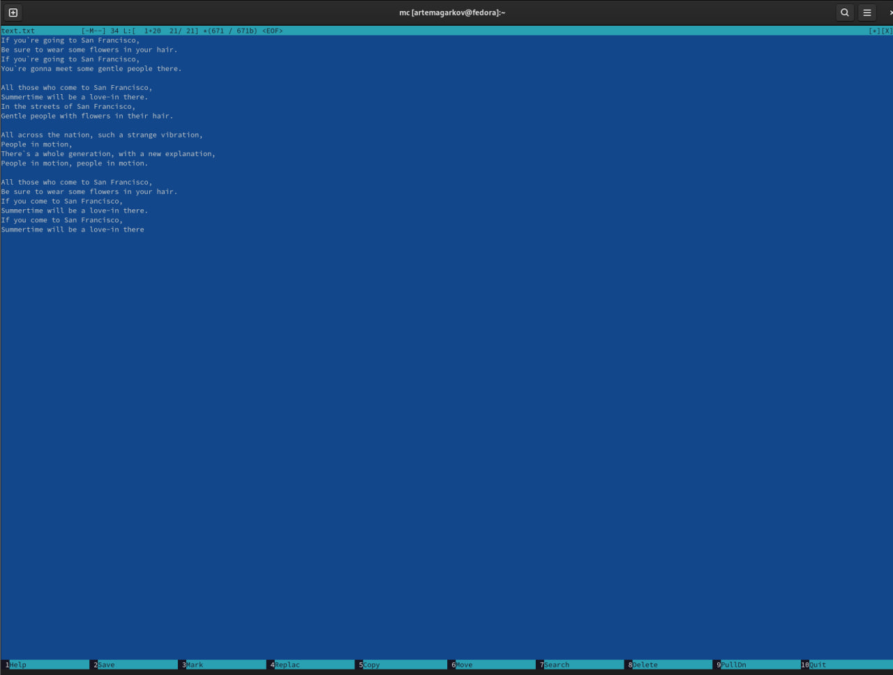
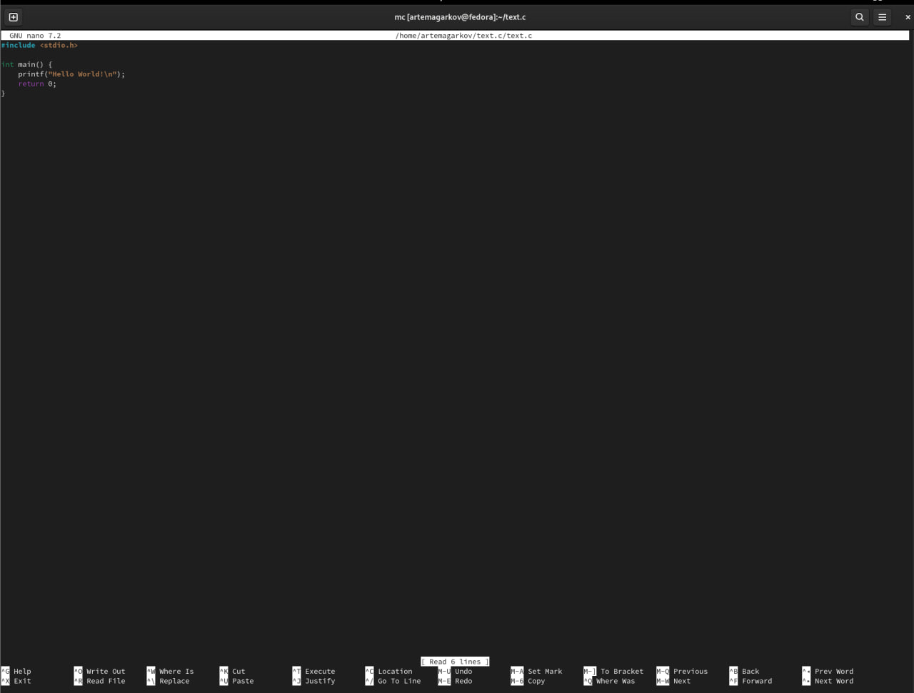
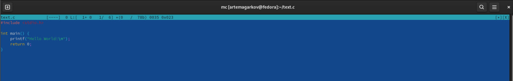

---
## Front matter
title: "Лабораторная работа № 7. Командная оболочка Midnight
Commander\

author: "Агарков Артём"

## Generic otions
lang: ru-RU
toc-title: "Содержание"

## Bibliography
bibliography: bib/cite.bib
csl: pandoc/csl/gost-r-7-0-5-2008-numeric.csl

## Pdf output format
toc: true # Table of contents
toc-depth: 2
lof: true # List of figures
lot: true # List of tables
fontsize: 12pt
linestretch: 1.5
papersize: a4
documentclass: scrreprt
## I18n polyglossia
polyglossia-lang:
  name: russian
  options:
	- spelling=modern
	- babelshorthands=true
polyglossia-otherlangs:
  name: english
## I18n babel
babel-lang: russian
babel-otherlangs: english
## Fonts
mainfont: PT Serif
romanfont: PT Serif
sansfont: PT Sans
monofont: PT Mono
mainfontoptions: Ligatures=TeX
romanfontoptions: Ligatures=TeX
sansfontoptions: Ligatures=TeX,Scale=MatchLowercase
monofontoptions: Scale=MatchLowercase,Scale=0.9
## Biblatex
biblatex: true
biblio-style: "gost-numeric"
biblatexoptions:
  - parentracker=true
  - backend=biber
  - hyperref=auto
  - language=auto
  - autolang=other*
  - citestyle=gost-numeric
## Pandoc-crossref LaTeX customization
figureTitle: "Рис."
tableTitle: "Таблица"
listingTitle: "Листинг"
lofTitle: "Список иллюстраций"
lotTitle: "Список таблиц"
lolTitle: "Листинги"
## Misc options
indent: true
header-includes:
  - \usepackage{indentfirst}
  - \usepackage{float} # keep figures where there are in the text
  - \floatplacement{figure}{H} # keep figures where there are in the text
---

# Цель работы

Освоение основных возможностей командной оболочки Midnight Commander. Приобретение навыков практической работы по просмотру каталогов и файлов; манипуляций
с ними.

# Задание

1. Создайте текстовой файл text.txt.
2. Откройте этот файл с помощью встроенного в mc редактора.
3. Вставьте в открытый файл небольшой фрагмент текста, скопированный из любого
другого файла или Интернета.
4. Проделайте с текстом следующие манипуляции, используя горячие клавиши:\
4.1. Удалите строку текста.\
4.2. Выделите фрагмент текста и скопируйте его на новую строку.\
4.3. Выделите фрагмент текста и перенесите его на новую строку.\
4.4. Сохраните файл.\
4.5. Отмените последнее действие.\
4.6. Перейдите в конец файла (нажав комбинацию клавиш) и напишите некоторый
текст.\
4.7. Перейдите в начало файла (нажав комбинацию клавиш) и напишите некоторый
текст.\
4.8. Сохраните и закройте файл.
5. Откройте файл с исходным текстом на некотором языке программирования (например C или Java)
6. Используя меню редактора, включите подсветку синтаксиса, если она не включена,
или выключите, если она включена 

# Выполнение лабораторной работы

1. Создайте текстовой файл text.txt

2. Откройте этот файл с помощью встроенного в mc редактора

3. Вставьте в открытый файл небольшой фрагмент текста, скопированный из любого
другого файла или Интернета

5. Откройте файл с исходным текстом на некотором языке программирования (например C или Java)

6. Используя меню редактора, включите подсветку синтаксиса, если она не включена,
или выключите, если она включена

# Контрольные вопросы и ответы

1. Какие режимы работы есть в mc. Охарактеризуйте их.
- Просмотр (View): Этот режим позволяет просматривать содержимое файлов и каталогов без возможности их редактирования.

- Редактирование (Edit): В этом режиме вы можете редактировать содержимое выбранного файла с помощью встроенного текстового редактора в MC.

- Копирование/Перемещение (Copy/Move): Режим, предназначенный для копирования или перемещения файлов и каталогов из одного места в другое.

- Поиск (Find): Позволяет выполнить поиск файлов и каталогов по заданным критериям в текущем каталоге или в заданном местоположении.

- Архивация (Pack): Этот режим используется для создания или распаковки архивов файлов.

- Удаление (Delete): Режим для удаления файлов и каталогов из файловой системы.

2. Какие операции с файлами можно выполнить как с помощью команд shell, так и с помощью меню (комбинаций клавиш) mc? Приведите несколько примеров.
- Команды shell: Переименование файла, изменение прав доступа, создание ссылки и т. д.
- Меню MC (комбинации клавиш): Копирование, перемещение, удаление файлов и каталогов, создание архивов, поиск файлов и т. д.
3. Опишите структура меню левой (или правой) панели mc, дайте характеристику командам.
- Файлы: Отображает содержимое текущего каталога.
- Информация: Показывает информацию о выбранном файле или каталоге.
- Команды: Позволяет выполнить различные команды для выбранных файлов и каталогов.
- Настройки: Позволяет настроить параметры MC.
4. Опишите структура меню Файл mc, дайте характеристику командам.
- Создать: Создает новый файл или каталог.
- Открыть: Открывает выбранный файл или каталог.
- Редактировать: Запускает встроенный текстовый редактор для редактирования выбранного файла.
- Копировать: Копирует выбранные файлы или каталоги.
- Переместить: Перемещает выбранные файлы или каталоги.
- Удалить: Удаляет выбранные файлы или каталоги.
5. Опишите структура меню Команда mc, дайте характеристику командам.
- Запуск команды: Позволяет выполнить команду в терминале.
- Выполнить команду на выделенном файле: Выполняет команду на выбранных файлах или каталогах.
6. Опишите структура меню Настройки mc, дайте характеристику командам.
- Панели: Позволяет настроить видимость панелей и их расположение.
- Параметры: Позволяет настроить различные параметры MC, такие как цвета, клавиши быстрого доступа и другие.
- Расширения: Позволяет настроить дополнительные функции и расширения MC.
7. Назовите и дайте характеристику встроенным командам mc.
- mc: Запускает Midnight Commander
- mcedit: Запускает встроенный текстовый редактор MC
- mcview: Запускает просмотрщик файлов в MC
- mc Переходит в указанный каталог
- mcedit file Открывает указанный файл для редактирования в MC
8. Назовите и дайте характеристику командам встроенного редактора mc.
- F2 - Сохранить
- F3 - Загрузить файл
- F5 - Копировать строку
- F6 - Переместить строку
- F7 - Удалить строку
- F8 - Отменить изменения
- F9 - Выйти из редактора
9. Дайте характеристику средствам mc, которые позволяют создавать меню, определяемые пользователем.
- MC позволяет создавать пользовательские меню, добавляя команды в файл mc.ext. Это позволяет пользователю создавать свои собственные команды и меню для удобства работы с MC.
10. Дайте характеристику средствам mc, которые позволяют выполнять действия, определяемые пользователем, над текущим файлом.
- MC предоставляет возможность настройки пользовательских действий, которые могут быть выполнены над выбранным файлом. Это делается через файл mc.menu.

# Выводы

Лабораторная работа с Midnight Commander позволяет освоить основные возможности командной оболочки, обогатив ваш арсенал навыков в работе с файлами и каталогами. В процессе выполнения этой работы вы узнаете, как перемещаться по файловой системе, просматривать содержимое каталогов, копировать, перемещать и удалять файлы, изменять их атрибуты, а также как выполнять другие распространенные операции. Практическое занятие с MC обеспечит вас уверенностью в работе с командной строкой и повысит вашу производительность при управлении файлами и каталогами.

