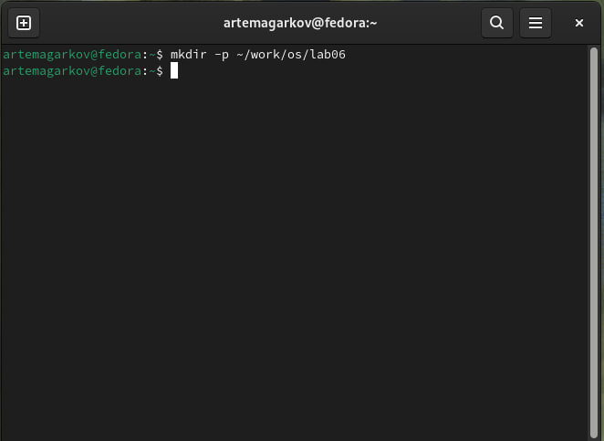
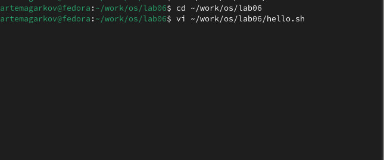
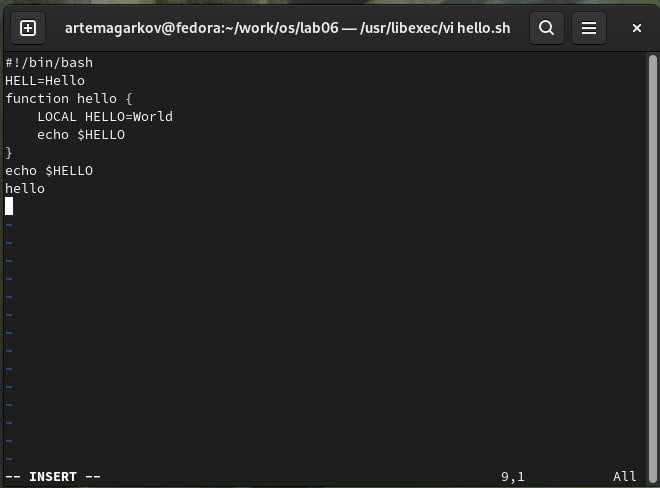
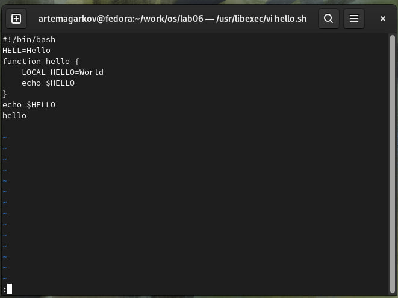
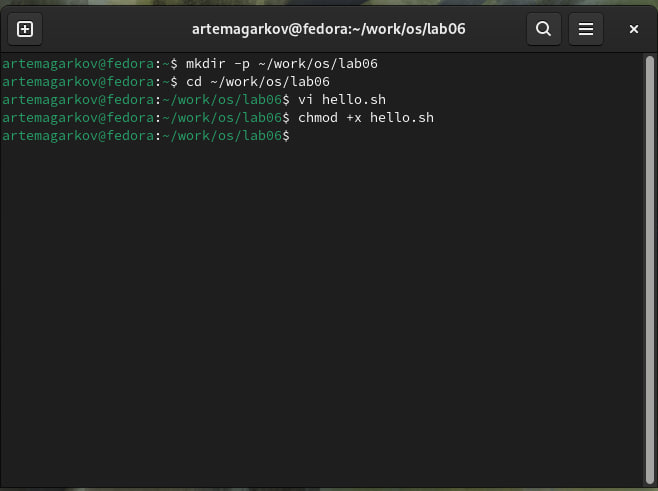
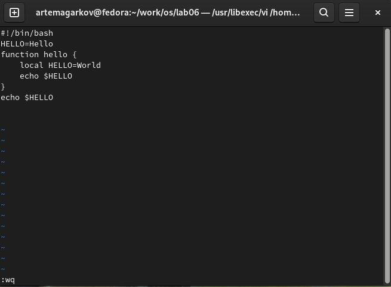

---
## Front matter
title: "Лабораторная работа № 8. Текстовой редактор vi"\
author: "Агарков Артём"

## Generic otions
lang: ru-RU
toc-title: "Содержание"

## Bibliography
bibliography: bib/cite.bib
csl: pandoc/csl/gost-r-7-0-5-2008-numeric.csl

## Pdf output format
toc: true # Table of contents
toc-depth: 2
lof: true # List of figures
lot: true # List of tables
fontsize: 12pt
linestretch: 1.5
papersize: a4
documentclass: scrreprt
## I18n polyglossia
polyglossia-lang:
  name: russian
  options:
	- spelling=modern
	- babelshorthands=true
polyglossia-otherlangs:
  name: english
## I18n babel
babel-lang: russian
babel-otherlangs: english
## Fonts
mainfont: PT Serif
romanfont: PT Serif
sansfont: PT Sans
monofont: PT Mono
mainfontoptions: Ligatures=TeX
romanfontoptions: Ligatures=TeX
sansfontoptions: Ligatures=TeX,Scale=MatchLowercase
monofontoptions: Scale=MatchLowercase,Scale=0.9
## Biblatex
biblatex: true
biblio-style: "gost-numeric"
biblatexoptions:
  - parentracker=true
  - backend=biber
  - hyperref=auto
  - language=auto
  - autolang=other*
  - citestyle=gost-numeric
## Pandoc-crossref LaTeX customization
figureTitle: "Рис."
tableTitle: "Таблица"
listingTitle: "Листинг"
lofTitle: "Список иллюстраций"
lotTitle: "Список таблиц"
lolTitle: "Листинги"
## Misc options
indent: true
header-includes:
  - \usepackage{indentfirst}
  - \usepackage{float} # keep figures where there are in the text
  - \floatplacement{figure}{H} # keep figures where there are in the text
---

# Цель работы

Познакомиться с операционной системой Linux. Получить практические навыки работы с редактором vi, установленным по умолчанию практически во всех дистрибутивах.

# Задание

Здесь приводится описание задания в соответствии с рекомендациями
методического пособия и выданным вариантом.

8.3.1. Задание 1. Создание нового файла с использованием vi
1. Создайте каталог с именем ~/work/os/lab06.
2. Перейдите во вновь созданный каталог.
3. Вызовите vi и создайте файл hello.sh
1 vi hello.sh
4. Нажмите клавишу i и вводите следующий текст.
1 #!/bin/bash
2 HELL=Hello
3 function hello {
4 LOCAL HELLO=World
5 echo $HELLO
6 }
7 echo $HELLO
8 hello
5. Нажмите клавишу Esc для перехода в командный режим после завершения ввода
текста.
6. Нажмите : для перехода в режим последней строки и внизу вашего экрана появится
приглашение в виде двоеточия.
7. Нажмите w (записать) и q (выйти), а затем нажмите клавишу Enter для сохранения
вашего текста и завершения работы.
8. Сделайте файл исполняемым
1 chmod +x hello.sh9. 

8.3.2. Задание 2. Редактирование существующего файла
1. Вызовите vi на редактирование файла
1 vi ~/work/os/lab06/hello.sh
2. Установите курсор в конец слова HELL второй строки.
3. Перейдите в режим вставки и замените на HELLO. Нажмите Esc для возврата в командный режим.
4. Установите курсор на четвертую строку и сотрите слово LOCAL.
5. Перейдите в режим вставки и наберите следующий текст: local, нажмите Esc для
возврата в командный режим.
6. Установите курсор на последней строке файла. Вставьте после неё строку, содержащую
следующий текст: echo $HELLO.
7. Нажмите Esc для перехода в командный режим.
8. Удалите последнюю строку.
9. Введите команду отмены изменений u для отмены последней команды.
10. Введите символ : для перехода в режим последней строки. Запишите произведённые
изменения и выйдите из vi.11. 

# Выполнение лабораторной работы

1. Создайте каталог с именем ~/work/os/lab06.

2. Перейдите во вновь созданный каталог.
3. Вызовите vi и создайте файл hello.sh
1 vi hello.sh

4. Нажмите клавишу i и вводите следующий текст.
1 #!/bin/bash\
2 HELL=Hello\
3 function hello {\
4 LOCAL HELLO=World\
5 echo $HELLO\
6 }\
7 echo $HELLO\
8 hello\

5. Нажмите клавишу Esc для перехода в командный режим после завершения ввода
текста.
6. Нажмите : для перехода в режим последней строки и внизу вашего экрана появится
приглашение в виде двоеточия\

7. Нажмите w (записать) и q (выйти), а затем нажмите клавишу Enter для сохранения
вашего текста и завершения работы.
8. Сделайте файл исполняемым
1 chmod +x hello.sh9

8.3.2. Задание 2. Редактирование существующего файла
1. Вызовите vi на редактирование файла
1 vi ~/work/os/lab06/hello.sh
2. Установите курсор в конец слова HELL второй строки.
3. Перейдите в режим вставки и замените на HELLO. Нажмите Esc для возврата в командный режим.
4. Установите курсор на четвертую строку и сотрите слово LOCAL.
5. Перейдите в режим вставки и наберите следующий текст: local, нажмите Esc для
возврата в командный режим.
6. Установите курсор на последней строке файла. Вставьте после неё строку, содержащую
следующий текст: echo $HELLO.
7. Нажмите Esc для перехода в командный режим.
8. Удалите последнюю строку.
9. Введите команду отмены изменений u для отмены последней команды.
10. Введите символ : для перехода в режим последней строки. Запишите произведённые
изменения и выйдите из vi.11. 11. 

## 8.5. Контрольные вопросы и ответы
1. Дайте краткую характеристику режимам работы редактора vi.
- Командный: ввод команд.
- Вставки: ввод текста.
- Последней строки: выполнение команд, начинающихся с :.
2. Как выйти из редактора, не сохраняя произведённые изменения?
- :q!
3. Назовите и дайте краткую характеристику командам позиционирования.
- h, j, k, l: влево, вниз, вверх, вправо.
- 0, $: начало и конец строки.
- gg, G: начало и конец файла.
- w, b: следующее и предыдущее слово.
4. Что для редактора vi является словом?
- Последовательность символов, разделенная пробелами или знаками пунктуации.
5. Каким образом из любого места редактируемого файла перейти в начало (конец)
файла?
- Начало: gg
- Конец: G
6. Назовите и дайте краткую характеристику основным группам команд редактирования.
- Удаление: x, dd
- Копирование: yy, yw
- Вставка: p, P
- Отмена: u
7. Необходимо заполнить строку символами $. Каковы ваши действия?
- Вставить $ в начало, затем Esc, потом 99.
8. Как отменить некорректное действие, связанное с процессом редактирования?
- Нажмите u.
9. Назовите и дайте характеристику основным группам команд режима последней строки.
- Сохранение: :w
- Выход: :q, :q!
- Сохранить и выйти: :wq, :x
10. Как определить, не перемещая курсора, позицию, в которой заканчивается строка?
- Включить :set ruler.
11. Выполните анализ опций редактора vi (сколько их, как узнать их назначение и т.д.).
- Все опции: :set all
- Конкретная опция: :set option?
12. Как определить режим работы редактора vi?
- Командный: виден курсор.
- Вставки: -- INSERT --.
- Последней строки: видна строка команд.
13. Постройте граф взаимосвязи режимов работы редактора vi.13. 
- Командный -> Вставки (i, a)
- Командный -> Последней строки (:)
- Вставки/Последней строки -> Командный (по Esc/выполнению команды).

# Выводы

В ходе выполнения данной лабораторной работы я познакомился с операционной системой Linux и получил практические навыки работы с текстовым редактором vi, который установлен по умолчанию в большинстве дистрибутивов. Эти навыки включают в себя управление режимами редактора, выполнение основных команд редактирования, навигацию по тексту, а также использование команд режима последней строки для сохранения и выхода из редактора.

