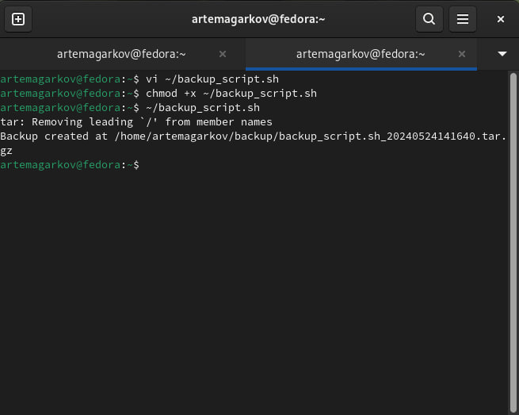

---
## Front matter
title: "Шаблон отчёта по лабораторной работе"
subtitle: "Простейший вариант"
author: "Дмитрий Сергеевич Кулябов"

## Generic otions
lang: ru-RU
toc-title: "Содержание"

## Bibliography
bibliography: bib/cite.bib
csl: pandoc/csl/gost-r-7-0-5-2008-numeric.csl

## Pdf output format
toc: true # Table of contents
toc-depth: 2
lof: true # List of figures
lot: true # List of tables
fontsize: 12pt
linestretch: 1.5
papersize: a4
documentclass: scrreprt
## I18n polyglossia
polyglossia-lang:
  name: russian
  options:
	- spelling=modern
	- babelshorthands=true
polyglossia-otherlangs:
  name: english
## I18n babel
babel-lang: russian
babel-otherlangs: english
## Fonts
mainfont: PT Serif
romanfont: PT Serif
sansfont: PT Sans
monofont: PT Mono
mainfontoptions: Ligatures=TeX
romanfontoptions: Ligatures=TeX
sansfontoptions: Ligatures=TeX,Scale=MatchLowercase
monofontoptions: Scale=MatchLowercase,Scale=0.9
## Biblatex
biblatex: true
biblio-style: "gost-numeric"
biblatexoptions:
  - parentracker=true
  - backend=biber
  - hyperref=auto
  - language=auto
  - autolang=other*
  - citestyle=gost-numeric
## Pandoc-crossref LaTeX customization
figureTitle: "Рис."
tableTitle: "Таблица"
listingTitle: "Листинг"
lofTitle: "Список иллюстраций"
lotTitle: "Список таблиц"
lolTitle: "Листинги"
## Misc options
indent: true
header-includes:
  - \usepackage{indentfirst}
  - \usepackage{float} # keep figures where there are in the text
  - \floatplacement{figure}{H} # keep figures where there are in the text
---

# Цель работы

Изучить основы программирования в оболочке ОС UNIX/Linux. Научиться писать
небольшие командные файлы.

# Задание

1. Написать скрипт, который при запуске будет делать резервную копию самого себя (то
есть файла, в котором содержится его исходный код) в другую директорию backup
в вашем домашнем каталоге. При этом файл должен архивироваться одним из архиваторов на выбор zip, bzip2 или tar. Способ использования команд архивации
необходимо узнать, изучив справку.
2. Написать пример командного файла, обрабатывающего любое произвольное число
аргументов командной строки, в том числе превышающее десять. Например, скрипт
может последовательно распечатывать значения всех переданных аргументов.
3. Написать командный файл — аналог команды ls (без использования самой этой команды и команды dir). Требуется, чтобы он выдавал информацию о нужном каталоге
и выводил информацию о возможностях доступа к файлам этого каталога.
4. Написать командный файл, который получает в качестве аргумента командной строки
формат файла (.txt, .doc, .jpg, .pdf и т.д.) и вычисляет количество таких файлов
в указанной директории. Путь к директории также передаётся в виде аргумента командной строки.

# Выполнение лабораторной работы

1. Написать скрипт, который при запуске будет делать резервную копию самого себя (то
есть файла, в котором содержится его исходный код) в другую директорию backup
в вашем домашнем каталоге. При этом файл должен архивироваться одним из архиваторов на выбор zip, bzip2 или tar. Способ использования команд архивации
необходимо узнать, изучив справку.

2. Написать пример командного файла, обрабатывающего любое произвольное число
аргументов командной строки, в том числе превышающее десять. Например, скрипт
может последовательно распечатывать значения всех переданных аргументов.

3. Написать командный файл — аналог команды ls (без использования самой этой команды и команды dir). Требуется, чтобы он выдавал информацию о нужном каталоге
и выводил информацию о возможностях доступа к файлам этого каталога.

4. Написать командный файл, который получает в качестве аргумента командной строки
формат файла (.txt, .doc, .jpg, .pdf и т.д.) и вычисляет количество таких файлов
в указанной директории. Путь к директории также передаётся в виде аргумента командной строки.

## 10.5. Контрольные вопросы и ответы
1. Объясните понятие командной оболочки. Приведите примеры командных оболочек.
Чем они отличаются?
- Командная оболочка - это интерактивная программа, которая позволяет пользователю взаимодействовать с операционной системой путем ввода команд. Примеры: Bash, Zsh, Fish. Они отличаются по функциональности и синтаксису.
2. Что такое POSIX?
- POSIX (Portable Operating System Interface) - это набор стандартов, разработанных для обеспечения совместимости между различными операционными системами UNIX.
3. Как определяются переменные и массивы в языке программирования bash?
- Переменные и массивы определяются в языке программирования Bash путем присваивания значений с помощью оператора =. Например: variable=value для переменной и array=(value1 value2 value3) для массива.
4. Каково назначение операторов let и read?
- Оператор let используется для выполнения арифметических операций в контексте командного файла, а оператор read используется для чтения ввода пользователя и присваивания его переменной.
5. Какие арифметические операции можно применять в языке программирования bash?
- В языке программирования Bash можно использовать арифметические операции, такие как сложение +, вычитание -, умножение *, деление /, а также операции сравнения, такие как > и <.
6. Что означает операция (( ))?
- Операция (( )) используется для выполнения арифметических вычислений в контексте командного файла.
7. Какие стандартные имена переменных Вам известны?
- Некоторые стандартные имена переменных: HOME (домашний каталог пользователя), PATH (путь поиска для исполняемых файлов), PWD (текущий рабочий каталог).
8. Что такое метасимволы?
- Метасимволы - это символы, которые имеют специальное значение в командной оболочке, такое как *, ?, [ и ].
9. Как экранировать метасимволы?
- Метасимволы могут быть экранированы с помощью символа обратного слеша \. Например, \$ экранирует символ $.
10. Как создавать и запускать командные файлы?
- Для создания командного файла необходимо создать файл с исполняемыми правами (chmod +x filename) и добавить в него команды, которые вы хотите выполнить. Для запуска командного файла просто введите его имя в терминале.
11. Как определяются функции в языке программирования bash?
- Функции определяются в языке программирования Bash с помощью ключевого слова function, за которым следует имя функции и тело функции. Например: function_name() { commands }.
12. Каким образом можно выяснить, является файл каталогом или обычным файлом?
- Для определения, является ли файл каталогом или обычным файлом, можно использовать команду test с параметром -d для каталога и -f для файла.
13. Каково назначение команд set, typeset и unset?
- Команда set используется для установки или изменения значений параметров и настроек командной оболочки. Команда typeset используется для объявления переменных с заданными свойствами. Команда unset используется для удаления переменных или функций.
14. Как передаются параметры в командные файлы?
- Параметры передаются в командные файлы в виде аргументов командной строки. Они доступны внутри файла через специальные переменные под нумерованными индексами, такие как $1, $2, и так далее.
15. Назовите специальные переменные языка bash и их назначение.15. 
- Некоторые специальные переменные Bash: $0 (имя текущего исполняемого файла), $# (количество аргументов командной строки), $? (код возврата последней выполненной команды).
# Выводы

 В процессе выполнения работы я ознакомился с основными принципами работы в командной оболочке, научился создавать, редактировать и выполнять командные файлы. Полученные навыки позволят мне эффективно управлять операционной системой и автоматизировать повседневные задачи.
