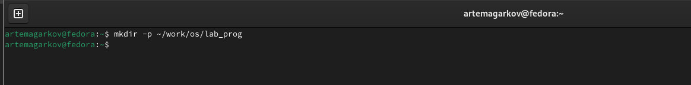
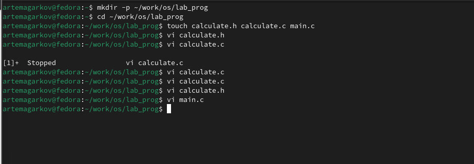
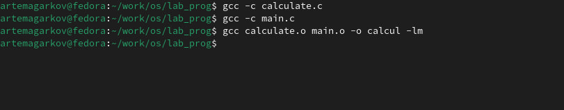
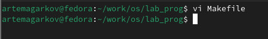
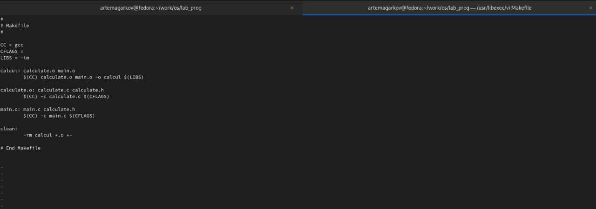
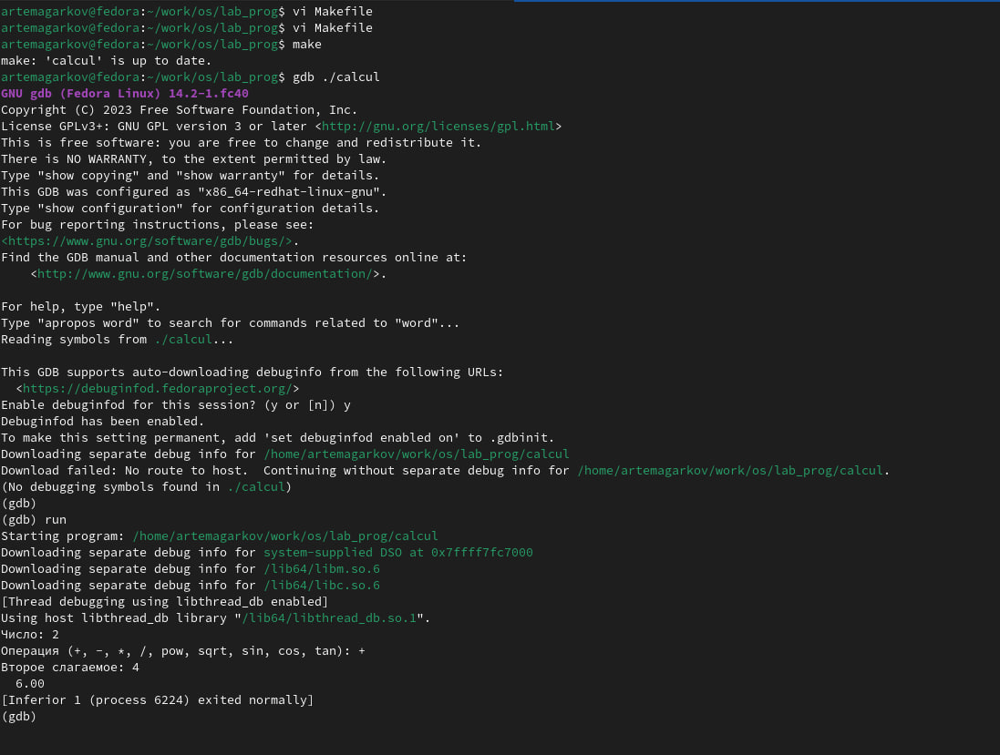

---
## Front matter
title: "Лабораторная работа № 13. Средства, применяемые при
разработке программного обеспечения в ОС типа UNIX/Linux."\
author: "Агарков Артём"

## Generic otions
lang: ru-RU
toc-title: "Содержание"

## Bibliography
bibliography: bib/cite.bib
csl: pandoc/csl/gost-r-7-0-5-2008-numeric.csl

## Pdf output format
toc: true # Table of contents
toc-depth: 2
lof: true # List of figures
lot: true # List of tables
fontsize: 12pt
linestretch: 1.5
papersize: a4
documentclass: scrreprt
## I18n polyglossia
polyglossia-lang:
  name: russian
  options:
	- spelling=modern
	- babelshorthands=true
polyglossia-otherlangs:
  name: english
## I18n babel
babel-lang: russian
babel-otherlangs: english
## Fonts
mainfont: PT Serif
romanfont: PT Serif
sansfont: PT Sans
monofont: PT Mono
mainfontoptions: Ligatures=TeX
romanfontoptions: Ligatures=TeX
sansfontoptions: Ligatures=TeX,Scale=MatchLowercase
monofontoptions: Scale=MatchLowercase,Scale=0.9
## Biblatex
biblatex: true
biblio-style: "gost-numeric"
biblatexoptions:
  - parentracker=true
  - backend=biber
  - hyperref=auto
  - language=auto
  - autolang=other*
  - citestyle=gost-numeric
## Pandoc-crossref LaTeX customization
figureTitle: "Рис."
tableTitle: "Таблица"
listingTitle: "Листинг"
lofTitle: "Список иллюстраций"
lotTitle: "Список таблиц"
lolTitle: "Листинги"
## Misc options
indent: true
header-includes:
  - \usepackage{indentfirst}
  - \usepackage{float} # keep figures where there are in the text
  - \floatplacement{figure}{H} # keep figures where there are in the text
---

# Цель работы

Приобрести простейшие навыки разработки, анализа, тестирования и отладки приложений в ОС типа UNIX/Linux на примере создания на языке программирования
С калькулятора с простейшими функциями.

# Задание

1. В домашнем каталоге создайте подкаталог ~/work/os/lab_prog.
2. Создайте в нём файлы: calculate.h, calculate.c, main.c.
Это будет примитивнейший калькулятор, способный складывать, вычитать, умножать
и делить, возводить число в степень, брать квадратный корень, вычислять sin, cos, tan.
При запуске он будет запрашивать первое число, операцию, второе число. После этого
программа выведет результат и остановится.
Реализация функций калькулятора в файле calculate.h:\
Интерфейсный файл calculate.h, описывающий формат вызова функциикалькулятора:\
Основной файл main.c, реализующий интерфейс пользователя к калькулятору:
3. Выполните компиляцию программы посредством gcc:
4. При необходимости исправьте синтаксические ошибки.
5. Создайте Makefile со следующим содержанием: 
6. С помощью gdb выполните отладку программы calcul (перед использованием gdb
исправьте Makefile):
– Запустите отладчик GDB, загрузив в него программу для отладки:
7. С помощью утилиты splint попробуйте проанализировать коды файлов calculate.c
и main.c. 

# Выполнение лабораторной работы

1. В домашнем каталоге создайте подкаталог ~/work/os/lab_prog.

2. Создайте в нём файлы: calculate.h, calculate.c, main.c.
Это будет примитивнейший калькулятор, способный складывать, вычитать, умножать
и делить, возводить число в степень, брать квадратный корень, вычислять sin, cos, tan.
При запуске он будет запрашивать первое число, операцию, второе число. После этого
программа выведет результат и остановится.
Реализация функций калькулятора в файле calculate.h:\
Интерфейсный файл calculate.h, описывающий формат вызова функциикалькулятора:\
Основной файл main.c, реализующий интерфейс пользователя к калькулятору:

3. Выполните компиляцию программы посредством gcc:\

5. Создайте Makefile со следующим содержанием. \

6. С помощью gdb выполните отладку программы calcul (перед использованием gdb
исправьте Makefile):
– Запустите отладчик GDB, загрузив в него программу для отладки:\

7. С помощью утилиты splint попробуйте проанализировать коды файлов calculate.c
и main.c.\

# 13.5. Контрольные вопросы и ответы
1. Как получить информацию о возможностях программ gcc, make, gdb и др.?
- Информацию о возможностях программ gcc, make, gdb и других утилит можно получить из их документации, которая часто включена в состав системы UNIX. Кроме того, можно использовать команды --help или -h, чтобы получить краткую справку о доступных опциях и ключах.
2. Назовите и дайте краткую характеристику основным этапам разработки приложений
в UNIX.
- Написание исходного кода на языке программирования (например, C, C++, Python).
- Компиляция исходного кода в исполняемый файл с помощью компилятора (например, gcc).
- Создание Makefile для автоматизации сборки программы.
- Отладка программы с использованием отладчика (например, gdb).
- Тестирование программы на различных входных данных.
- Улучшение и оптимизация кода.
3. Что такое суффикс в контексте языка программирования? Приведите примеры использования.
- В контексте языка программирования суффикс - это часть имени файла, которая указывает на тип или формат файла. Например, в файлах исходного кода на C обычно используются суффиксы .c, .h, а в исполняемых файлах - суффикс .exe (для Windows) или отсутствует (для UNIX).
4. Каково основное назначение компилятора языка С в UNIX?
- Основное назначение компилятора языка С в UNIX - это преобразование исходного кода на языке C в машинный код, который может быть выполнен на конкретной архитектуре процессора.
5. Для чего предназначена утилита make?
- Утилита make предназначена для автоматизации процесса сборки программы из исходных файлов. Она читает файл Makefile, содержащий инструкции о том, какие файлы нужно компилировать и как их компилировать, и выполняет соответствующие действия.
6. Приведите пример структуры Makefile. Дайте характеристику основным элементам
этого файла.
- target: dependencies
    command1
    command2
    ...

7. Назовите основное свойство, присущее всем программам отладки. Что необходимо
сделать, чтобы его можно было использовать?
- Основное свойство, присущее всем программам отладки, - это возможность пошагового выполнения программы и анализа её состояния во время выполнения. Для использования этой возможности необходимо скомпилировать программу с отладочной информацией и запустить её в отладчике.
8. Назовите и дайте основную характеристику основным командам отладчика gdb.
- run: запуск программы.
- break: установка точки останова.
- list: просмотр исходного кода.
- print: вывод значения переменной.
- next: выполнение следующей строки.
- step: выполнение следующей строки с заходом в функции.
- continue: продолжение выполнения программы до следующей точки останова.
9. Опишите по шагам схему отладки программы, которую Вы использовали при выполнении лабораторной работы.
- Схема отладки программы включает в себя компиляцию программы с отладочной информацией, запуск программы в отладчике, установку точек останова, пошаговое выполнение программы, анализ переменных и структуры программы для выявления ошибок.

10. Прокомментируйте реакцию компилятора на синтаксические ошибки в программе
при его первом запуске.
- При первом запуске компилятора gcc программа выводит сообщения об ошибках и предупреждениях в коде программы, если они есть. Это могут быть синтаксические ошибки, неправильное использование функций или другие проблемы, которые необходимо исправить.
11. Назовите основные средства, повышающие понимание исходного кода программы.
- Основные средства, повышающие понимание исходного кода программы, включают в себя комментарии в коде, разбиение кода на логические блоки, использование осмысленных имен переменных и функций, а также документацию к программе.
12. Каковы основные задачи, решаемые программой splint?12. 
- Программа splint предназначена для анализа исходного кода на языке программирования C и выявления потенциальных проблем с его безопасностью и надежностью. Основные задачи, решаемые программой splint, включают обнаружение утечек памяти, неинициализированных переменных, ошибок в использовании указателей, а также других типов ошибок, которые могут привести к непредсказуемому поведению программы или уязвимостям безопасности.

# Выводы

В результате выполнения лабораторной работы были приобретены простейшие навыки разработки, анализа, тестирования и отладки приложений в операционных системах типа UNIX/Linux. Процесс создания калькулятора на языке программирования C включал в себя создание файлов с кодом (calculate.c, main.c, calculate.h), компиляцию и сборку программы с использованием утилит gcc и make, а также отладку с помощью отладчика gdb. В ходе работы были освоены основные этапы разработки приложений в UNIX, включая написание и отладку кода, использование инструментов сборки и отладки, а также анализ кода с использованием инструментов статического анализа, таких как splint. Полученные навыки позволяют создавать простые программы и эффективно их отлаживать и анализировать.

